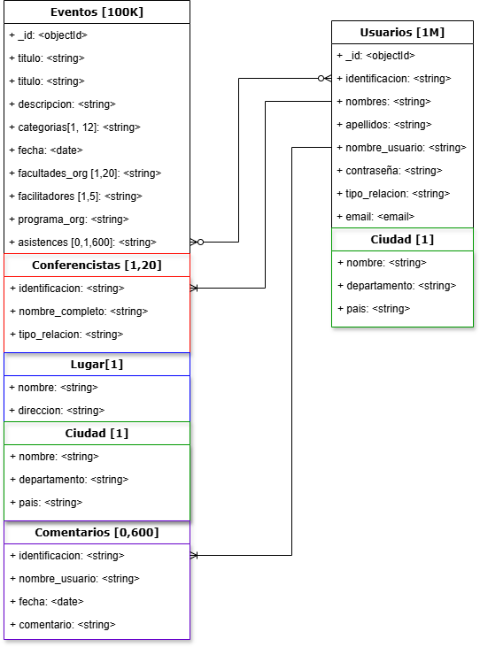

# Implementación del Sistema de Gestión de Eventos

### Integrantes

* Silem Nabib Villa Contreras
* Andrés David Parra García
* Maria Alejandra Mantilla Coral

## Descripción del Proyecto

Una universidad del suroccidente colombiano requiere una aplicación para gestionar eventos, charlas, conferencias y reuniones. Esta aplicación debe registrar los eventos y almacenar la información en una base de datos NoSQL (MongoDB). Además, debe integrarse con una base de datos relacional (PostgreSQL) que contiene información sobre los profesores, programas, facultades y sedes.

## Ejecución

Para ejecutar el proyecto, siga los siguientes pasos una vez descomprimido el archivo del proyecto y ubicado en la carpeta correspondiente:

1. (Opcional - Recomendable) Abrir una terminal y crear un entorno virtual:

   ```sh
   py -m venv venv  # Crea un entorno independiente
   venv\Scripts\activate  # Activa el entorno
   ```
2. Instalar las dependencias necesarias:

   ```sh
   pip install -r requirements.txt
   ```
3. Ejecutar el servidor de desarrollo:

   ```sh
   py manage.py runserver
   ```
4. Ingresar a la dirección [http://127.0.0.1:8000/](http://127.0.0.1:8000/) (puede utilizar credenciales existentes o crear un nuevo usuario).

   Credenciales existentes:

   * Usuario: 123456789
   * Contraseña: Icesi1234

## Informe del Proyecto

### Decisión sobre el Uso de Tecnologías

#### Elección de MongoDB

Para la base de datos NoSQL, se optó por MongoDB debido a su flexibilidad para manejar documentos JSON, lo cual facilita la gestión de datos semi-estructurados como los eventos y comentarios que se registrarán en la aplicación. MongoDB es ideal para este tipo de aplicaciones debido a:

1. **Flexibilidad del Esquema:** Los eventos pueden tener estructuras variadas (diferentes categorías, número de asistentes, etc.). MongoDB permite almacenar documentos con esquemas flexibles, lo que facilita la adaptación a los cambios en los requisitos del sistema.
2. **Escalabilidad Horizontal:** MongoDB está diseñado para escalar horizontalmente, lo que significa que se pueden agregar más servidores a medida que crece la cantidad de eventos y usuarios, garantizando un rendimiento óptimo.
3. **Consultas Ad-hoc:** El sistema requiere consultas basadas en categorías y otros criterios. MongoDB ofrece un lenguaje de consulta flexible y potente que permite realizar búsquedas eficientes y personalizadas.
4. **Rendimiento:** MongoDB es conocido por su alto rendimiento en operaciones de lectura y escritura, lo que es crucial para un sistema de gestión de eventos donde la velocidad de acceso a los datos es importante.

### Matriz de Decisión para la Elección de Base de Datos NoSQL

Para determinar si MongoDB es la mejor opción para esta aplicación, se compararon varias bases de datos NoSQL populares: MongoDB, CouchDB, Cassandra y Redis. La siguiente matriz de decisión muestra los criterios clave y su evaluación:

| Criterio                                        | MongoDB                                                                                | CouchDB                                                                                | Cassandra                                                                       | Redis                                                                               |
| ----------------------------------------------- | -------------------------------------------------------------------------------------- | -------------------------------------------------------------------------------------- | ------------------------------------------------------------------------------- | ----------------------------------------------------------------------------------- |
| **Flexibilidad del Esquema**           |  Alta (documentos JSON)                 |  Alta (documentos JSON)                 |  Baja (columnas)                 |  Moderada (clave-valor)              |
| **Escalabilidad Horizontal**           |  Alta                         |  Alta                         |  Muy Alta                  |  Alta                       |
| **Consultas Ad-hoc**               |  Muy buenas                       |  Muy buenas                       |  Limitadas                 |  Limitadas                     |
| **Rendimiento (Lectura/Escritura)**       |  Alta                         |  Alta                         |  Muy Alta                  |  Muy Alta                      |
| **Facilidad de Uso**               |  Alta (amplia documentación)             |  Alta                         |  Media (curva de aprendizaje)      |  Media (uso específico)              |
| **Integración con Django**           |  Muy buena (Djongo)                   |  Limitada                        |  Limitada                  |  Baja                       |

De acuerdo con esta evaluación, MongoDB se presenta como la mejor opción para la base de datos NoSQL debido a su flexibilidad, escalabilidad, rendimiento y facilidad de integración con Django.

### Matriz de Decisión para la Elección del Framework para el Desarrollo Web

La elección de Django como framework para el desarrollo web se sustentó en varios factores clave comparados con otras opciones como Flask, React, y Node.js:

| Criterio                                | Django                                                                                           | React                                                                                   | Flask                                                                                              | Node.js (Express)                                                                             |
| --------------------------------------- | ------------------------------------------------------------------------------------------------ | --------------------------------------------------------------------------------------- | -------------------------------------------------------------------------------------------------- | --------------------------------------------------------------------------------------------- |
| **Facilidad de Desarrollo**       |  Alta (estructura MVC, herramientas integradas)     |  Media (requiere configuración adicional) |  Media (mayor flexibilidad, pero más configuración) |  Baja (requiere más conocimiento de JavaScript) |
| **Curva de Aprendizaje**        |  Moderada                              |  Alta (solo front-end)                   |  Moderada                                     |  Alta                                 |
| **Soporte de la Comunidad**       |  Extenso                              |  Muy grande, activa                    |  Moderada                                     |  Grande, activa                            |
| **Escalabilidad**            |  Alta                                |  Alta                           |  Limitada sin plugins                               |  Alta, con Microservices                        |
| **Rendimiento**             |  Bueno                               |  Excelente (renderizado en el cliente)     |  Bueno                                       |  Excelente                               |
| **Adecuación a MongoDB**       |  Buena (integración con Djongo)                  |  Buena (librerías disponibles)            |  Buena (librerías disponibles)                       |  Buena (librerías disponibles)                  |
| **Integración con BD**        |  Excelente soporte para SQL y NoSQL                 |  Necesita API backend                   |  Básico, necesita plugins                            |  Muy buena, con Mongoose                        |
| **Características**          |  Incluye admin, ORM, autenticación                |  Solo para UI                       |  Muy básico, extensible                             |  Muy flexible, extensible                       |

Django fue seleccionado por su robustez y su capacidad para manejar tanto la lógica del backend como la integración con múltiples tipos de bases de datos. Además, Django ofrece un sistema de administración incorporado que facilita la gestión de datos y usuarios.

### Implementación de la Aplicación

#### Estructura del Proyecto

El proyecto se organizó en varias aplicaciones dentro de Django para mantener un código modular y limpio. Las principales carpetas y archivos incluyen:

- `src/connections.py`: Configura las conexiones a MongoDB y PostgreSQL.
- `src/manage.py`: Utilidad para tareas administrativas de Django.
- `src/mongodb_documents.py`: Define funciones para crear documentos MongoDB.
- `event_log`: Aplicación Django para gestionar eventos.
- `event_management`: Configuración principal del proyecto Django.
- `event_management/middleware.py`: Implementa un middleware para requerir inicio de sesión en rutas específicas.
- `event_management/settings.py`: Configuración del proyecto Django, incluyendo la configuración de bases de datos.

#### Conexión a las Bases de Datos

La conexión a MongoDB y PostgreSQL se realizó mediante el uso de `pymongo` y `psycopg2`, respectivamente. Las credenciales y detalles de conexión se gestionaron mediante variables de entorno para mantener la seguridad.

```python
from pymongo import MongoClient
import psycopg2
import os

client = MongoClient(os.getenv('DJANGO_HOST'))
db = client['django_db']

universitydb = psycopg2.connect(
    dbname=os.getenv('UNIVERSITY_DB'),
    user=os.getenv('UNIVERSITY_USER'),
    password=os.getenv('UNIVERSITY_PASSWORD'),
    host=os.getenv('UNIVERSITY_HOST')
)
```

#### Modelado de Datos en MongoDB



Los documentos de MongoDB se definieron para incluir todos los detalles necesarios de eventos, usuarios y comentarios:

```python
def evento_doc(titulo, descripcion, categorias, fecha, lugar_datos, conferencistas, facilitadores, facultades_org, programa_org, img_url=None):
    event_document = {
        "titulo": titulo,
        "descripcion": descripcion,
        "categorias": categorias,
        "fecha": fecha,
        "conferencistas": conferencistas,
        "facilitadores": facilitadores,
        "facultades_org": facultades_org,
        "lugar": {
            "nombre": lugar_datos[0],
            "direccion": lugar_datos[1],
            "ciudad": {
                "nombre": lugar_datos[2][0],
                "departamento": lugar_datos[2][1],
                "pais": lugar_datos[2][2]
            }
        }
    }
    if programa_org:
        event_document["programa_org"] = programa_org
    if img_url:
        event_document["img_url"] = img_url
    return event_document
```

#### Integración entre Bases de Datos

Para mostrar información relacionada con eventos, la aplicación consulta tanto MongoDB como PostgreSQL. Las consultas a PostgreSQL se realizan para obtener datos específicos de profesores y programas, mientras que MongoDB almacena y recupera información de eventos y usuarios:

```python
from connections import universitydb, users, evento

def get_conferencistas(request):
    conferencistas = []
    conferencista_search = request.GET.get('confer_search')

    if conferencista_search.isdigit():
        cursor = users.find({'identificacion': {'$regex': conferencista_search}}, {'_id': 0, 'identificacion': 1, 'nombres': 1, 'apellidos': 1})
    else:
        cursor = users.find({'nombre_completo': {'$regex': conferencista_search}}, {'_id': 0, 'identificacion': 1, 'nombres': 1, 'apellidos': 1})

    for doc in cursor:
        conferencistas.append(doc)

    return JsonResponse(conferencistas, safe=False)
```

### Consideraciones finales

* Se implementaron medidas de seguridad, como el cifrado de contraseñas y la protección contra ataques CSRF, para garantizar la seguridad de los datos de los usuarios.
* Se utilizó un middleware de autenticación para restringir el acceso a ciertas funcionalidades solo a usuarios autenticados.
* Se implementó un sistema de búsqueda de eventos por título y categorías para facilitar la navegación de los usuarios.

### Conclusión

La decisión de utilizar Django junto con MongoDB y PostgreSQL proporciona una solución robusta y escalable para la gestión de eventos en la universidad. Django facilita la integración con múltiples bases de datos y ofrece herramientas poderosas para el desarrollo rápido de aplicaciones web. MongoDB proporciona la flexibilidad necesaria para manejar los datos semi-estructurados de los eventos, mientras que PostgreSQL asegura la integridad y consistencia de los datos relacionales.
